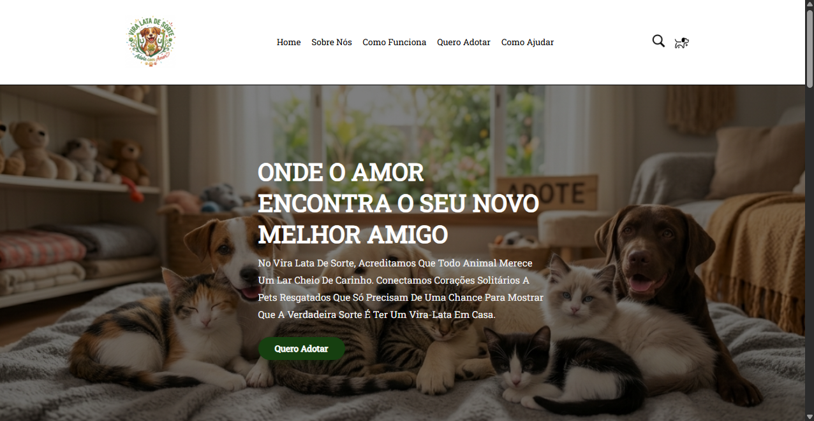
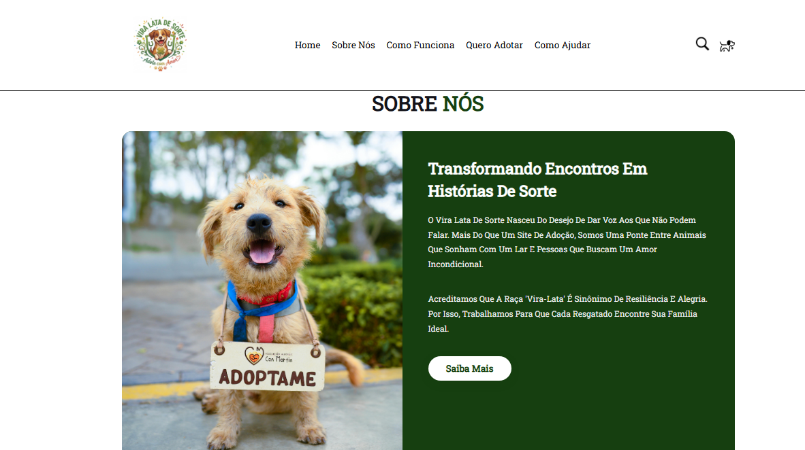
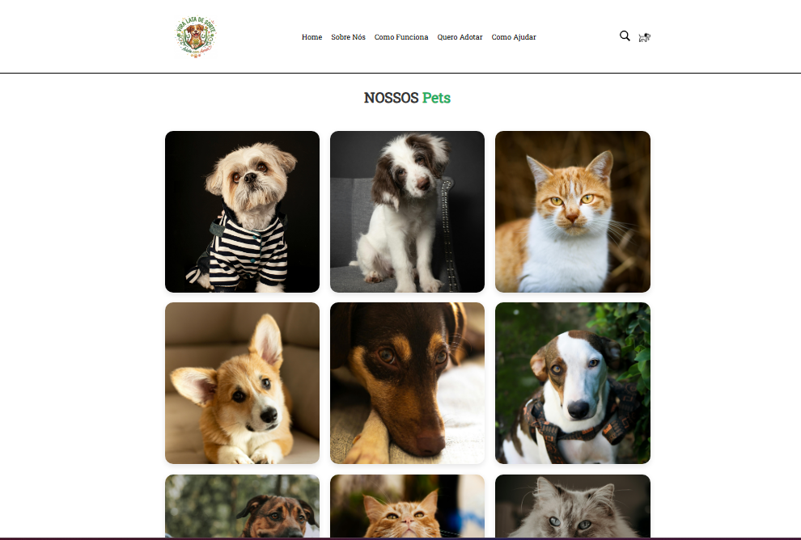
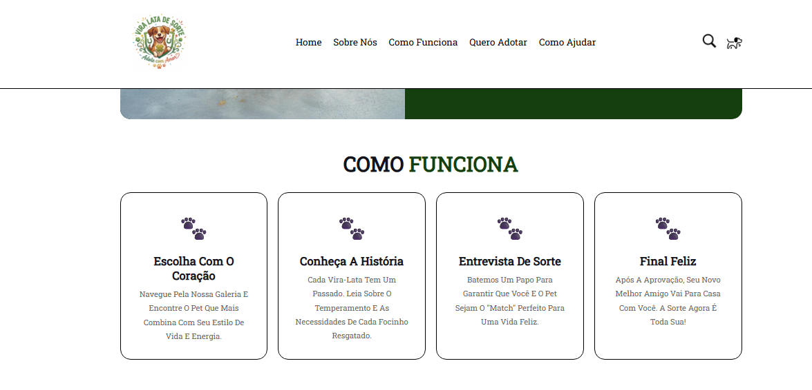
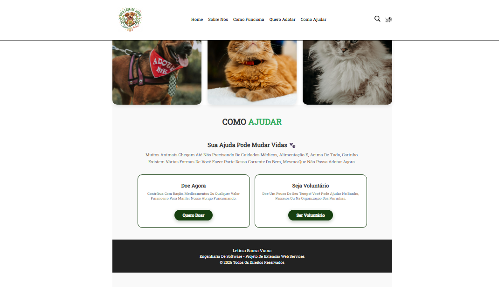

# 🐾 Adote um Amigo - Projeto de Extensão

Projeto desenvolvido para a disciplina de **Web Services** do curso de **Engenharia de Software**. O site foca na conscientização sobre adoção responsável e voluntariado em ONGs.

## 🚀 Tecnologias Utilizadas
* HTML5
* CSS3 (Grid Layout e Flexbox)
* Design Responsivo

## 📌 Funcionalidades
* Galeria interativa com efeito overlay (Hover) para informações dos pets.
* Seção de conscientização e chamadas para ação (CTA) para doações e voluntariado.
* Navegação por âncoras para melhor experiência do usuário (UX).

## 👩‍💻 Autora
**Letícia Souza Viana** - Acadêmica de Engenharia de Software.

## 🌐 Contexto Acadêmico
Este projeto faz parte do portfólio de extensão, visando futuramente a integração com Web Services (APIs) para gestão de dados de animais e sistemas de pagamento para doações.

## 📸 Demonstração do Projeto

Abaixo, você pode visualizar as principais seções da interface desenvolvida para o projeto de adoção.
### 🏠 Home e Sobre Nós

### 🐾 Galeria de Pets e Como Funciona

### ❤️ Conscientização e Apoio

